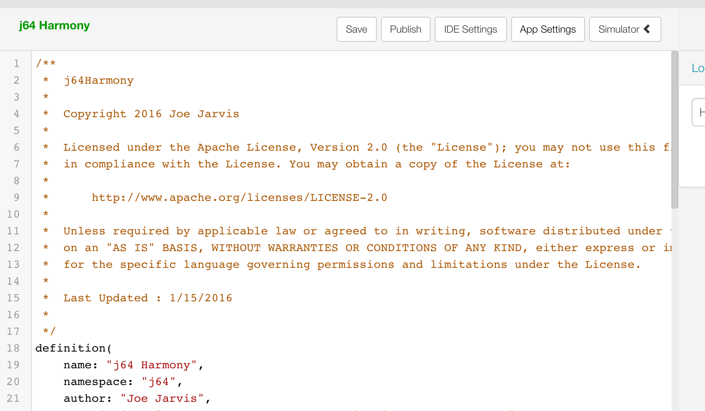
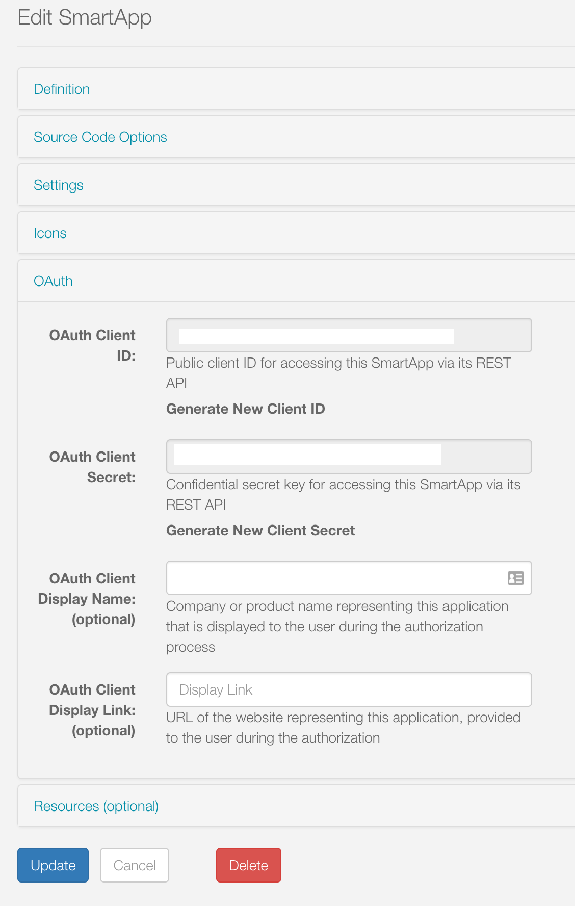
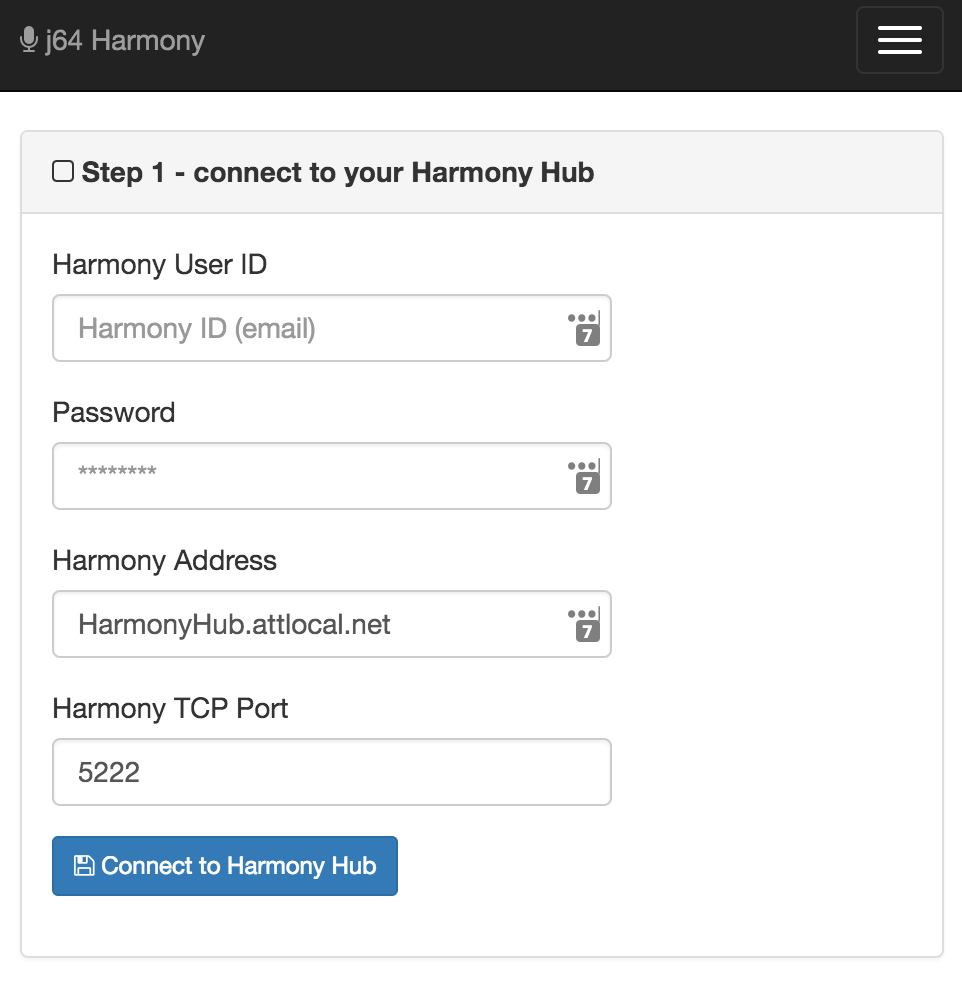
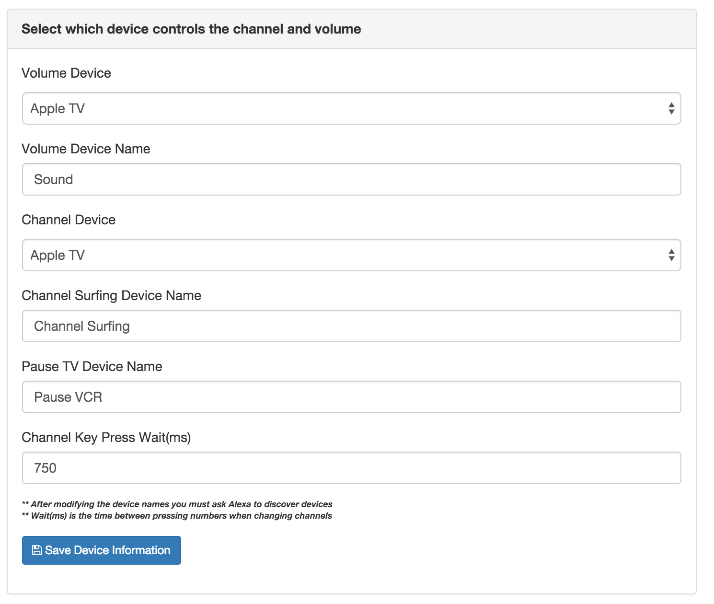
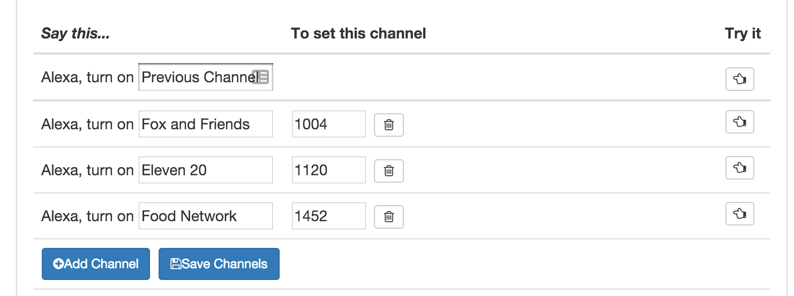
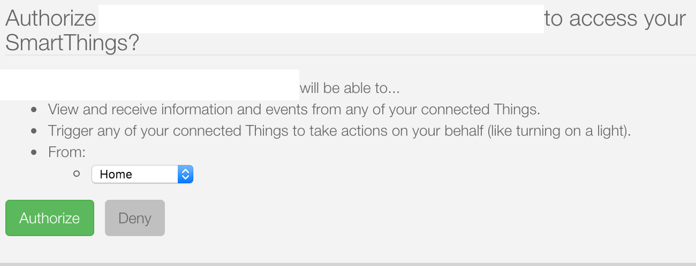
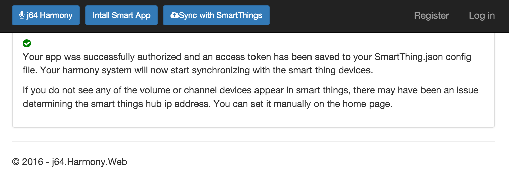
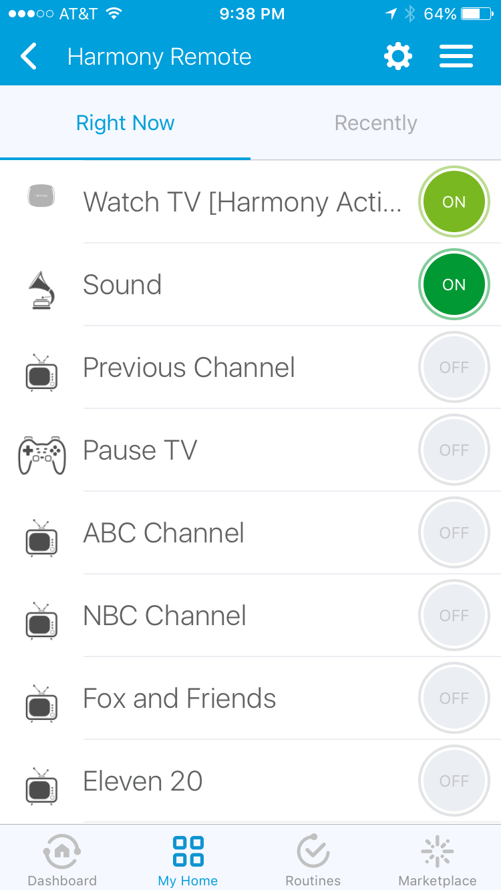

# Pre-Reqs
1. A Mac, Windows or Linux machine to run the j64 app on
2. A working Smart Things Hub
2. A working Harmony Hub
3. A working Amazon Echo
4. Basic understanding of SmartThings devices & smart apps


# Overview of Steps
Here are the abbreviated, one liner, list of install steps:

1. Install asp.net framework (http://get.asp.net)
2. git clone https://github.com/joejarvis64/j64.Harmony.git
3. dnu restore j64.Harmony.Xmpp 
4. dnu restore j64.Harmony.WebApi
5. Install j64*SmartApp.groovy SmartApp into the IDE 
6. Install j64*Device.groovy Device Types into the IDE 
7. Run the web app -- cd src/j64.Harmony.WebApi; dnx web
8. Configure the channels/apps
  * Harmony id/password
  * Set the Channel/Volume Device
  * Install the smart app via j64 webapi
  * Add custom channel names via the web app
  * Discover devices on amazon echo

Start telling Alexa to control the volume and channels!

# Step 1 - Install the Asp.Net Core Framework
Go to http://get.asp.net and install a copy of the dot net core framework on the machine you will use to run j64HarmonyServer.  It is a pretty easy install process, just click the "Install for Mac" or "Install for Windows" button and run the executable that is downloaded.

If you are installing on a windows machine you may need to take a couple of extra steps to get everything running properly.  In my case I had do this:

1. Goto get.asp.net and click the Asp.Net RC 5 "Install for Windows" button and run the executable that it downloads
2. Reboot windows so the environment will be set properly
3. After restarting, open a command prompt and run the upgrade command to get the runtime, dnx and dnu utilities installed properly:
```
dnvm upgrade -r coreclr 
```

# Step 2 - Download a copy of the j64.Harmony
I do not have a installer package yet so you will need to download and install it manually.  You will need to be familiar with github to do this.  The easiest way is to clone a copy of the repository into a directory on your machine.  There is also an option to download a zip file from there at which you would just unzip it onto your local machine.  The github repository for j64Harmony is located here: https://github.com/joejarvis64/j64.Harmony.git

# Step 3 - Install the j64Harmony Smart App
Eventually I will get these published on smart things but for now you have to manually add these smart apps and device types into your developer account on smart things.  First make sure you have an account setup here:  https://graph.api.smartthings.com/login/auth.  It is free for everyone so just sign up if you don't have one already.

Next, select the SmartApps option at the top of the web page to show all of the smart apps you have already installed.  Once there, click on the big green "New SmartApp" button on the right side of the page.

 

The next page that comes up will have a form to create a new smart app.  You should select the "From Code" option at the top of the page.

 

That will open up a blank text box.  Copy all of the code from j64HarmonySmartApp.groovy into that text box.  Then click the Create button at the bottom of the page.

That will bring up the editor for the smart app.  At this point you will want to click the "Publish" button at the top of that page.  This will publish the smart app and make it avaialble for use under your personal ID.

 

Now that you have published the app you will need to get an Oauth key that will be used down on step #9.  To do this click the "App Settings" button next the the publish button.  That will take you to the following page.  Open up the Oauth Section and click "Enable Oauth in Smart App" button. You will need the Oauth Client ID & Oauth Client Secret down in step #8.  

Be sure to click the Update button at the bottom of this page or it will not actually save that Oauth information.

 


# Step 4 - Install all of the j64 Device Types
The process for install custom device types is almost identical to smart apps.  The only difference is that you will select the "Device Handlers" option at the top of the page.  Once there you will click on "Create New Device Handler", then select the "From Code" option.  Finally just like you did for the smart app you will need to publish the device handler once you have created it.

You will want to create custom device handlers for each of the following files:
* j64ChannelSwitchDevice.groovy
* j64SurfingSwitchDevice.groovy
* j64VCRSwitchDevice.groovy
* j64VolumeSwitchDevice.groovy


# Step 5 - Build the j64.Harmony app

The exact steps for this build will vary slightly depending on whether you are running on a mac, windows or linux.  The following instructions are for a mac but should also apply for the other environments. 

1. Bring up a terminal session and change to the directory where you cloned the respository in step 2 above

2. change to the src directory that contains each of the projects.  There are 2 projects that need to be restored and built.  It should look something like this:
 > 
 
3. Next change to the j64.Harmony.Xmpp directory and restore it with this command:
  > dnu restore
  
  You will see a bunch of packages being downloaded from github.  This is normal the first time you run and it may take a minute or two to get everything downloaded.  Repeat this restore command for the j64.Harmony.WebApi folder.
  
4. Next, build the j64.Harmony.WebApi project
  > dnu build
  
  Again, you will see a bunch of messages flying across the screen.  The last messages displayed should indicate that it built successfully.
   > 
   
  
# Step 6 - Run the Web App

Now you are ready to run the app.  Change ot the j64.HarmonyServer.WebApi directory and run the app with "dnx web".

```
cd j64.Harmony.WebApi
dnx web
```


At this point you will see some messages displaying on the screen that look something like this:

```
Joes-iMac:j64.Harmony.WebApi joe$ dnx web
Hosting environment: Production
Now listening on: http://0.0.0.0:2065
Application started. Press Ctrl+C to shut down.
```

One thing to notice is the line near the bottom that show what port it is listening on.  This line means that it is listening on all of your network interfaces (0.0.0.0) on TCP port 2065.   
```
Now listening on: http://0.0.0.0:2065
```

**Important**: if you are on windows and you get a message asking you to allow firewall access be sure to click allow access.  If you say no, the smart things hub will not be able to talk with the j64Harmony web app.


# Step 7 - Open the App

Now that you have a web server running, you can bring up a browser on the machine and go to the app.  So you would open this url:  http://localhost:2065

First, you will need to enter your account information for the harmony hub.  This is the email/password you used to initialize the harmony hub at the myharmony.com site.  Once you have 
successfully entered your password you will receive a screen that allows you to name any channels that you want to be able to speak to Alexa. 

 > 

Next, you must set which device you use to control the volume and change channels on the TV.  

 > 

Finally, add any channels that you want to be able to speak to Alexa.  You may have to experiment with channel names that the 
Echo will recognize.  I have found that names like "Discovery Channel" cause the echo to start discovering new devices rather than
turning on this channel.  Or names like "Fox News" cause the Echo device to turn on the fox news radio channel via amazon
prime.  You can try new names and change them as often as you like.  If you do change the names just click the "Sync with Smarthings"
button at the top of the page to get the new device to be set up on your mobile device. 

 > 

# Step 8 - Install the SmartApp

Click on the "Install SmartApp" button at the top of the page.  This will bring up a page where you can put in the client id and secret key you created when you installed the smart app into your Smart Things developer IDE (see step #3 above).

Paste in both the client key and secrect key.  Then click the "Begin Authorization" button.  

 > 
 
This will take you to a SmartThings authorization screen.  If you are sent to a smart things error page it typically means that you have entered an invalid client key or secret key.  Double check you work from step #3 and make sure you actually enabled and updated the oauth key.  Also be sure to cut/paste since typing those guids is nearly impossible.

The SmartThings authorization screen you see will look like this.  Select the hub you want to install this onto and then click the authoize button.  It can take 20-30 seconds for the authorization to happen so be patient.

 > 
 
 
 After you have successfully authorized you are redirected back to the j64Harmony web app.  It should say that you have succesfully authorized the smart app.  At this point, you can bring up your mobile app and you should see the j64 smart app and j64 device types installed.  
 The devices in the mobile app are named according to the information that you setup on the home page of the j64 Harmony app.

> 
 
# Step 9 - Test it out
 
 If you have reached this point everything should be ready to go.  Pull up your Smart Things mobile app and you should be able to find the devices in your "Things" section.  Everything is named as you specified on the home page of the j64 Harmony App.  I like to put all of these devices into a room in the mobile app since that makes it easy to find all of the devices.
 
 > 

# Step 10 - Add the devices to the Amazon Echo App

Before you can speak these device names to the echo, you must add these new devices into the amazon Echo smart app.  Once you have added them there, ask Alexa to discover new devices.  

Now you should be ready to try everything out!


 
