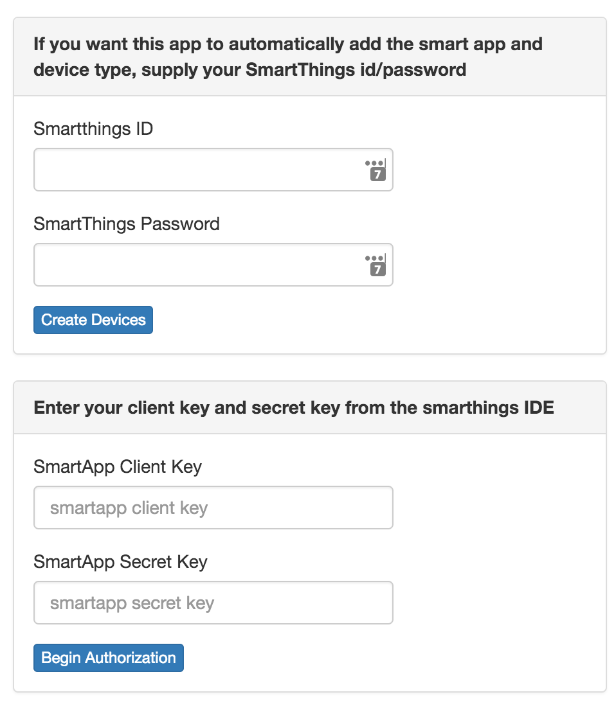
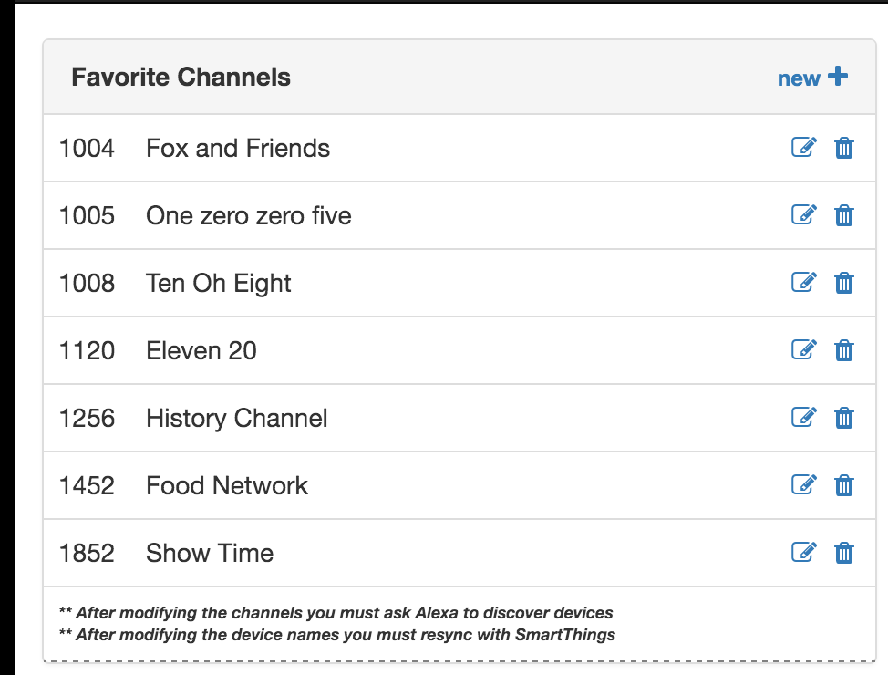

# Pre-Reqs
1. A Mac, Windows or Linux machine to run the j64 app on
2. A working Smart Things Hub
2. A working Harmony Hub
3. A working Amazon Echo
4. Basic understanding of SmartThings devices & smart apps


# Overview of Steps
Here are the abbreviated, one liner, list of install steps:

1. Install asp.net framework (http://get.asp.net)
2. git clone https://github.com/joejarvis64/j64.Harmony.git
3. run j64Start
4. Launch a browser at http://localhost:2065 and configure the app
  * Harmony id/password
  * Set the Volume/Channel Device
  * Install the smart app via j64 Harmony App
5. Test it out via the mobile app
6. Add devices to Amazon Echo Smart App
  * Run discover devices on amazon echo
  
Start telling Alexa to control the volume and channels!

# Step 1 - Install the Asp.Net Core Framework
Go to http://get.asp.net and install a copy of the dot net core framework on the machine you will use to run j64HarmonyServer.  It is a pretty easy install process, just click the "Install for Mac" or "Install for Windows" button and run the executable that is downloaded.

If you are installing on a windows machine you may need to take a couple of extra steps to get everything running properly.  In my case I had do this:

1. Goto get.asp.net and click the Asp.Net RC 5 "Install for Windows" button and run the executable that it downloads
2. Reboot windows so the environment will be set properly
3. After restarting, open a command prompt and run the upgrade command to get the runtime, dnx and dnu utilities installed properly:
```
dnvm upgrade -r coreclr 
```

# Step 2 - Download a copy of the j64.Harmony
I do not have a installer package yet so you will need to download and install it manually.  You will need to be familiar with github to do this.  The easiest way is to clone a copy of the repository into a directory on your machine.  There is also an option to download a zip file from there at which you would just unzip it onto your local machine.  The github repository for j64Harmony is located here: https://github.com/joejarvis64/j64.Harmony.git

# Step 3 - Start up the j64Harmony  App
Start up a terminal session or command prompt if you are in windows and run the following commands:

```
cd j64.HarmonyApp
./j64Start

NOTE: If you are on windows just type in "j64Start" without the ./ at the front
```


Once the app starts up you should see a message like this on the terminal:
```
Hosting environment: Production
Now listening on: http://0.0.0.0:2065
Application started. Press Ctrl+C to shut down.
```
This means the web app is up, running and listeniong on port 2065.
```

**Important**: if you are on windows and you get a message asking you to allow firewall access be sure to click allow access.  If you say no, the smart things hub will not be able to talk with the j64Harmony web app.


# Step 4 - Open the App

Now that you have a j64 web server running, you can bring up a browser on the machine and go to the app.  So you would open this url:  http://localhost:2065

First, you will need to enter your account information for the harmony hub.  This is the email/password you used to initialize the harmony hub at the myharmony.com site.

 > 

Once you have successfully entered your password and connected you will receive a screen that allows you to specify which device you use to control the sound and channels on your TV.

 > 

Now the app can automatically create the smart app and device types in the SmartThings IDE.  You can do this manually if you prefer, however if you enter your smart things ID & Password it will login to the IDE and load them for you.  Just hit the "Create Devices" button and wait, it can takes a few minutes to get them added and published so be patient.

 > 

Once the Device Types and SmartApps have been added, it will fill in the client key and secret key for you.  After that happens click "Begin Authorization" and it will take you to a SmartThings authorization screen which look like this.  Select the hub you want to install this onto and then click the authoize button.  It can take 20-30 seconds for the authorization to happen so be patient.

 > 
 
 
 After you have successfully authorized you are redirected back to the j64Harmony web app.  It should say that you have succesfully authorized the smart app.  
 
> 

 At this point, you can bring up your mobile app and you should see the j64 smart app and j64 device types installed.  A default set of devices and channels are automatically added and named according to the information that you setup on the home page of the j64 Harmony app.  If you want to change those names or add different channels, you can look under the Configure Menu on the j64 app to add or change favorite channel names.

> 
 
# Step 5 - Test it out
 
 If you have reached this point everything should be ready to go.  Pull up your Smart Things mobile app and you should be able to find the devices in the "Things" section.  Everything is named as specified in the Configure section the j64 Harmony App (also seen on the home page).  I like to put all of these devices into a room in the mobile app since that makes it easy to find all of the devices.
 
 > 

# Step 6 - Add the devices to the Amazon Echo App

Before you can speak these device names to the echo, you must add these new devices into the amazon Echo smart app.  Once you have added them there, ask Alexa to discover new devices.  

Now you should be ready to try everything out!


 
