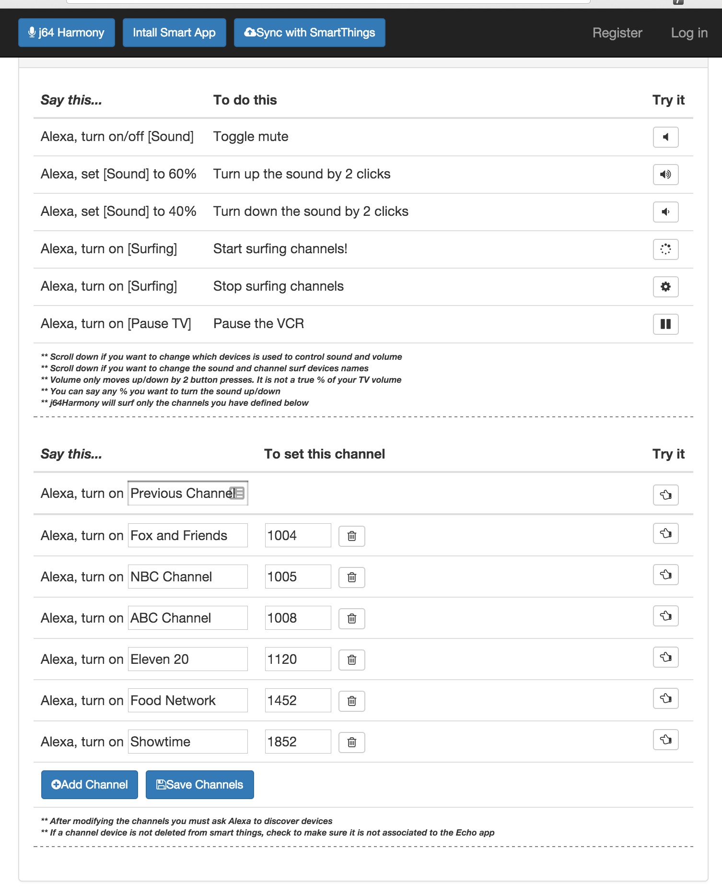

# j64.Harmony
A Server to integrate the harmony hub with Smart Things

This server with associated smart apps and device types allow you to integrate the Harmony Hub into smart things and the Amazon Echo.  
While you currently can start and stop activities within the harmony hub, it is somewhat difficult to control individual devices like 
the volume or send commands to mute the TV.  

I wrote this program because I wanted to be able to say "Alexa, turn off sound" when I was away from the remote, perhaps in the kitchen.  
I also wanted the ability to easily pause the VCR under that same scenario.  This app allows me to speak those phrase and also a few others 
that I threw in just for fun:

One of the biggest challenges with writing this app was figuring out how to call the harmony remote.  There are many 
[variations](https://github.com/jterrace/pyharmony) of this program on github that demonstrate how to call the harmony hub. 
 I probably could have just used one of those as a base but I am a C# programmer and wanted to improve my skills in the new 
AspNet.Core cross platform framework being developed by Microsoft.  So I wrote this app to do just that.

If you have a mac, windows or linux machine to run this app on, follow the [GettingStarted.md](Documentation/GettingStarted.md) guide to get everything setup and ruunning.
